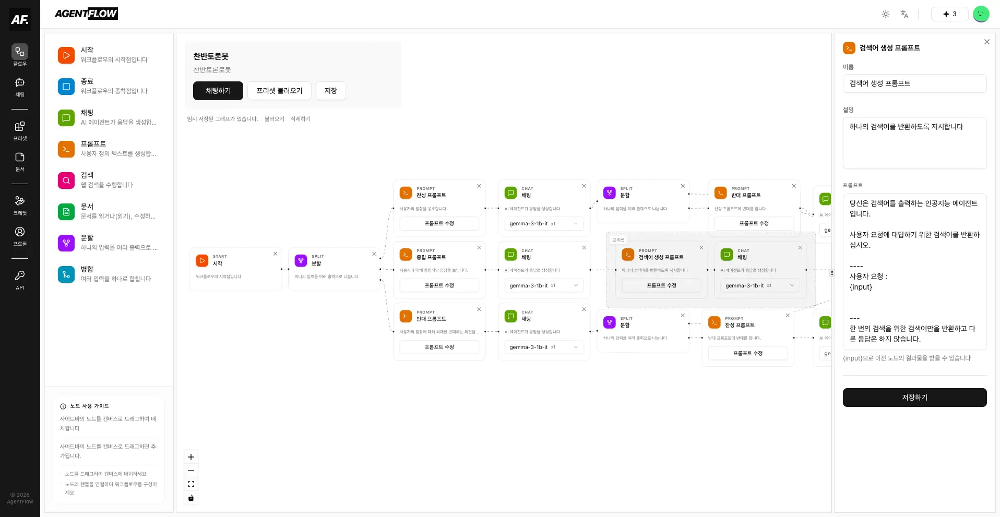
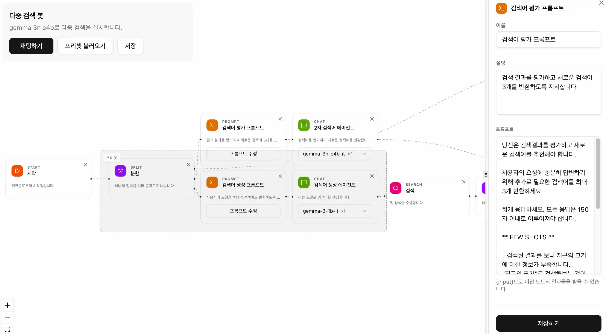
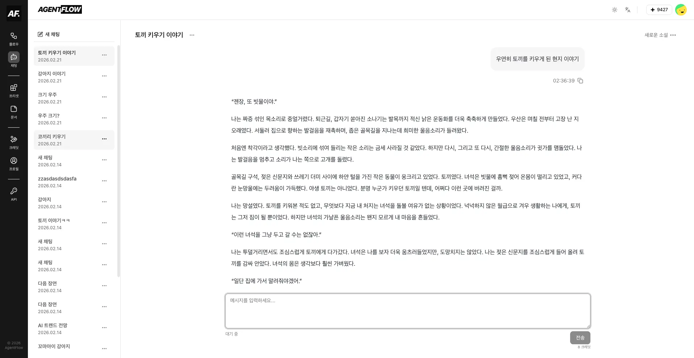
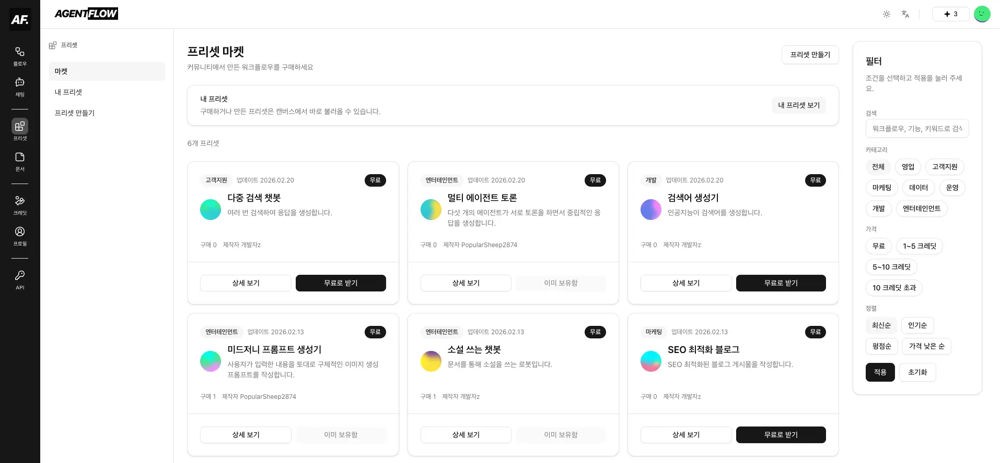
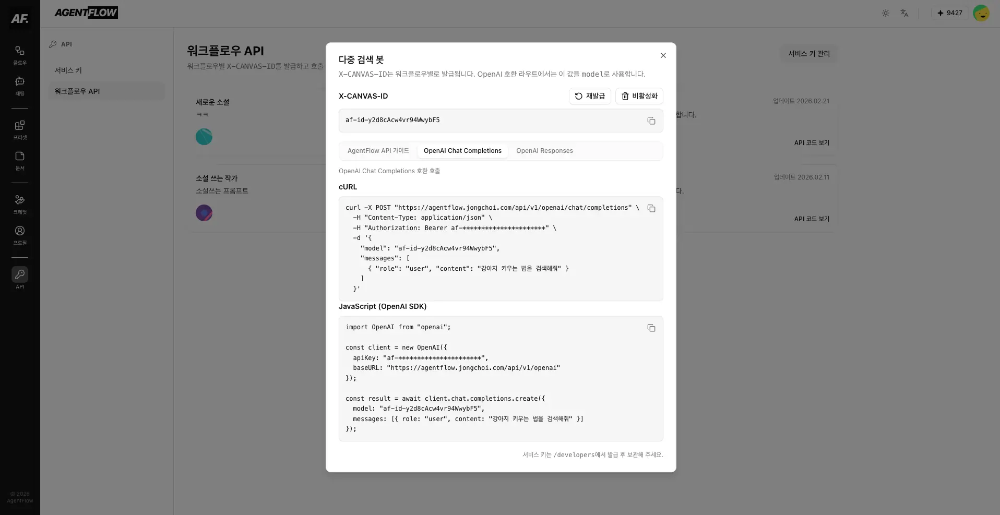
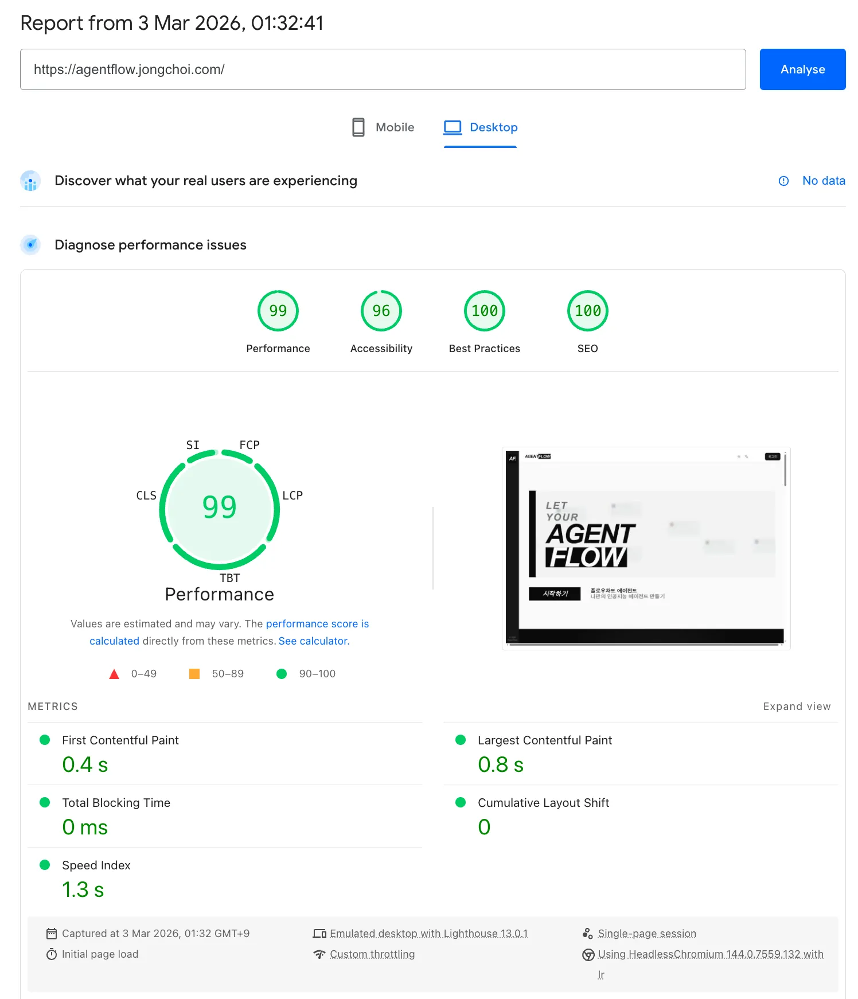

# AgentFlow

<p align="center">
  
</p>

플로우 차트를 통해 인공지능 에이전트를 편집하고, 채팅 UI로 실행할 수 있는 AI 오케스트레이션 플랫폼입니다.

## 프로젝트 특징

- `React Flow`를 통해 LangGraph 오케스트레이션을 편집하고 실행할 수 있습니다.
- 워크플로우를 다른 사용자들과 공유하고, 다른 사용자들이 공유한 워크플로우를 프리셋으로 불러올 수 있습니다.
- 워크플로우를 REST API로 외부 서비스에서 호출하고 사용할 수 있습니다.

## 프로젝트 기간

- **프로젝트 시작일 : 2025.12.05 ~**
- **1차 배포 : 2026.02.16**
- **서비스 URL**: https://agentflow.jongchoi.com/

## 기술 스택

- **프레임워크**: Next.js 16 (Cache Components)
- **UI**: Tailwind CSS v4, Shadcn/UI
- **상태관리**: Zustand, React Query
- **DB**: PostgreSQL, Drizzle ORM
- **AI 오케스트레이션**: LangGraph
- **테스팅** : Playwright, Vitest
- **기타**: Next-intl(국제화), NextAuth.js v5(인증), React Flow (플로우차트)

## 주요 기능

### 캔버스 에디터 (Canvas Editor)

> **URL**: `/workflows/canvas`

<p align="center">
  
</p>

- 드래그 앤 드롭으로 플로우 차트를 만들고 수정합니다. 시각적으로 AI 오케스트레이션을 설계할 수 있습니다.
- Fan-out, Fan-in을 이용한 병렬 실행에 특화되어 있습니다. 여러 에이전트를 동시에 실행하고 응답을 하나로 병합합니다.
- '문서' 기능을 이용해 에이전트가 워크플로우 실행 중 마크다운을 읽고, 편집할 수 있습니다. 인공지능의 메모리와 결과물을 문서로 저장하세요.
- '프리셋' 기능을 이용해 기존에 저장된 워크플로우나 공유된 워크플로우들을 불러와 재사용할 수 있습니다. 좋은 프롬프트나 워크플로우를 만들었다면 언제든지 저장하고, 공유하고, 다시 불러올 수 있습니다.

### 채팅 (Chat)

> **URL**: `/chat`

<p align="center">
  
</p>

- 워크플로우는 서버에서 동적으로 AI 오케스트레이션을 빌드하고 실행합니다. 언제든지 수정하고, 테스트하고, 채팅을 이어갈 수 있습니다.
- 사용자의 채팅 내용을 토대로 자동으로 채팅 제목이 생성됩니다. 데이터베이스 기반 체크포인터를 통해 연결이 불안정한 상황에서도 응답이 생성되고 저장됩니다.
- 실시간으로 응답을 스트리밍 받고, Message Queue를 이용해 연속적으로 작업을 지시할 수 있습니다.

### 프리셋 마켓 (Presets)

> **URL**: `/presets`

<p align="center">
  
</p>

- 프리셋 마켓에서 다양한 프리셋을 검색하고, 구매할 수 있습니다. 자신이 생성하거나 구매한 프리셋은 워크플로우에 프리셋의 형태로 저장하고 불러올 수 있습니다.
- 프리셋을 마켓 플레이스에 공유하고 판매하여 워크플로우 실행에 필요한 크레딧을 획득할 수 있습니다.
- 프리셋을 만들기 위해 다른 프리셋을 조합하였다면, 프리셋의 모든 소유자들에게 자동으로 크레딧을 정산하여 줍니다.

### OpenAI 호환 API

<p align="center">
  
</p>

- 생성된 워크플로우를 외부에서 실행할 수 있도록 OpenAI Chat Completions API와 호환되는 HTTP 엔드포인트를 제공합니다. OpenAI SDK를 비롯한 다양한 서비스에 연결할 수 있습니다.

```ts
import OpenAI from "openai";

const client = new OpenAI({
  apiKey: "af-your-service-key",
  baseURL: "https://agentflow.jongchoi.com/api/v1/openai",
});

const completion = await client.chat.completions.create({
  model: "af-id-1234567890",
  messages: [{ role: "user", content: "강아지 키우는 법에 대한 블로그 게시물 작성해줘" }],
});
```

## 시스템 아키텍처

### Cache Components (Partial Prerendering)

Next.js 16의 Cache Components 설정을 활성화하여 아래와 같이 성능을 최적화하였습니다.

- Partial Prerendering을 이용하여 페이지 간에 즉각적인 이동과 점진적인 로딩으로 지연 시간을 최소화하였습니다. 사용자가 자주 방문하는 Sidebar Nav의 페이지들은 Prefetch를 이용해 로딩을 줄였습니다.
- 사용자의 개인화된 데이터는 "use cache" 지시어를 활용하여 각 사용자별로 데이터를 캐싱하였고, 이를 통해 DB 조회 횟수와 재접속한 사용자의 로딩 속도를 줄였습니다.
- "use cache"와 `updateTag()`를 일관되게 활용하여 복잡한 상태관리 없이도 서버 컴포넌트를 실시간으로 업데이트하도록 구현하였고, 클라이언트 컴포넌트에서는 React Query를 이용한 낙관적 업데이트로 DB 조회를 최소화하였습니다.

### LangGraph

- xyflow로 구현된 node와 edge 정보를 LangGraph로 변환하는 엔진을 구현하여, 시각적으로 편집된 플로우 차트를 동적인 LangGraph 오케스트레이션으로 생성하도록 하였습니다.
- 임시 채팅은 서버 메모리를 사용하여 신속하게 실행되도록 하되, 5분 후 세션을 삭제하도록 하여 메모리 누수를 막았습니다.
- Chat UI에서의 채팅은 DB를 통해 관리하도록 하여 연결이 불안정하거나 응답이 늦는 경우에도 서버에 저장될 수 있도록 하였습니다.
- Server-Sent Events 방식을 이용하여 클라이언트에서 실시간으로 응답을 스트리밍 받고 다양한 상태 UI를 표시할 수 있도록 하였으며, 클라이언트의 Chat UI에서는 requestAnimationFrame을 이용해 프레임 성능을 최적화하여 고속 인퍼런스 제공자(e.g. Groq의 gpt-oss-20b 모델 등)를 동시 실행하는 중에서도 끈김없이 렌더링될 수 있도록 구현하였습니다.
- 워크플로우를 실행하는 엔진을 OpenAI 호환 환경을 비롯한 외부 환경에서 사용할 수 있도록 Next.js의 Route Handler로 REST API를 구현하였습니다.

### 기타 구현내용

- 테스팅 : 핵심 비즈니스 로직들을 순수 함수로 분리하여 vitest를 통해 유닛 테스트로 작성하고 전체 검증은 Playwright를 통한 E2E 테스트로 작성하여, 회귀를 방지하면서도 유연한 리팩토링이 가능하도록 하였습니다.
- Drizzle ORM : Drizzle ORM을 통해 DB를 통합하여 쿼리·캐시키·타입과 스키마를 Next.js로 관리하는 풀스택으로 개발하였습니다.
- 국제화 : next-intl을 Next.js Cache Components와 연동하여 번역이 필요한 컴포넌트들도 Prerendering되도록 구현하였습니다.
- DDD 폴더 구조 : 프로젝트를 총 9개의 피처로 나는 도메인 주도 개발 폴더구조로 유지 보수성을 높이고자 하였습니다.
  ```text
  src
  ├─ app
  │  └─ [locale]/presets
  │     ├─ page.tsx
  │     ├─ purchased/page.tsx
  │     └─ [id]/page.tsx
  ├─ features
  │  └─ presets
  │     ├─ components
  │     ├─ constants
  │     ├─ hooks
  │     ├─ store
  │     └─ server
  │        ├─ actions.ts
  │        ├─ queries.ts
  │        └─ cache/tags.ts
  └─ db
    └─ schema/presets.ts
  ```

## PageSpeed 성능 결과

<p align="center">
  
</p>
