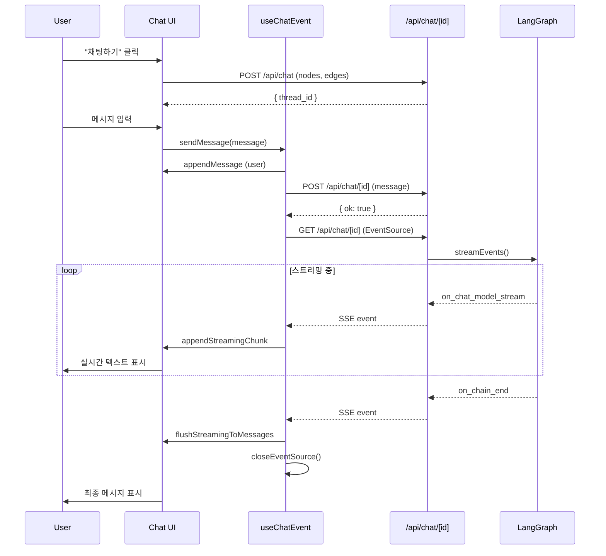

# PR: 채팅 페이지 기능 구현

> **브랜치**: `feat/chat-page`  
> **커밋 범위**: `2a4e2d4` ~ `a8a81ff` (총 7개 커밋)

## 개요

이 PR은 LangGraph 기반의 실시간 채팅 기능을 구현합니다. EventSource(SSE)를 활용한 스트리밍 응답, Zustand 기반 상태 관리, 그리고 마크다운 렌더링을 지원하는 채팅 UI를 포함합니다.

---

## 주요 변경 사항

### 1️⃣ 아키텍처 변경

#### API 라우트 핸들러 분리 (`a4d8bf4`)

**목적**: POST/GET 요청을 분리하여 EventSource 사용 가능하도록 구조 개선

##### 📁 변경된 파일

- **[NEW]** [`src/app/api/chat/[id]/_handlers/post.ts`](file:///Users/jonghyunchoi/Desktop/ActiveProject/drizzle-setup/src/app/api/chat/[id]/_handlers/post.ts)
- **[NEW]** [`src/app/api/chat/[id]/_handlers/get.ts`](file:///Users/jonghyunchoi/Desktop/ActiveProject/drizzle-setup/src/app/api/chat/[id]/_handlers/get.ts)
- **[NEW]** [`src/app/api/chat/[id]/_handlers/index.ts`](file:///Users/jonghyunchoi/Desktop/ActiveProject/drizzle-setup/src/app/api/chat/[id]/_handlers/index.ts)
- **[MODIFIED]** [`src/app/api/chat/[id]/route.ts`](file:///Users/jonghyunchoi/Desktop/ActiveProject/drizzle-setup/src/app/api/chat/[id]/route.ts)

##### 🔍 상세 내용

**POST 핸들러** - 메시지 저장 담당

```typescript
// src/app/api/chat/[id]/_handlers/post.ts
export async function POST(request: Request, { params }: RouteContext<"/api/chat/[id]">) {
  const { message } = parsed.data;
  const threadContext = threadContextManager.get(threadId);

  const state: ThreadContext["state"] = {
    ...threadContext.state,
    messages: [...threadContext.state.messages, new HumanMessage(message)],
    initialInput: message,
  };

  threadContextManager.set({ ...threadContext, state });
  return Response.json({ ok: true });
}
```

**핵심 역할**:

- 사용자 메시지를 `threadContext`에 저장
- `HumanMessage` 객체로 변환하여 메시지 히스토리에 추가
- 즉시 응답 반환 (스트리밍은 GET에서 처리)

**GET 핸들러** - EventSource 스트리밍 담당

```typescript
// src/app/api/chat/[id]/_handlers/get.ts
export async function GET(request: Request, { params }: RouteContext<"/api/chat/[id]">) {
  const graph = buildStateGraph(threadContext.graph);
  const app = graph.compile({ checkpointer });

  const stream = new ReadableStream({
    async start(controller) {
      for await (const chunk of app.streamEvents(state, {
        version: "v2",
        configurable: { thread_id: threadId },
        durability: "exit",
      })) {
        // 이벤트 필터링 및 변환
        if (type === "chatNode" && event === "on_chat_model_stream") {
          emitEvent({
            type,
            event,
            langgraph_node,
            chunk: { content },
          });
        }
      }
    },
  });

  return new Response(stream, {
    headers: {
      "Content-Type": "text/event-stream",
      "Cache-Control": "no-cache",
      Connection: "keep-alive",
    },
  });
}
```

**핵심 역할**:

- LangGraph의 `streamEvents` API를 사용하여 실시간 스트리밍
- `ReadableStream`으로 SSE 응답 생성
- 노드 타입별 이벤트 필터링 (`startNode`, `chatNode`, `endNode`)
- `durability: "exit"` 설정으로 종료 시점에만 상태 업데이트

**이벤트 타입 정의**

```typescript
// src/app/api/chat/_types/chat-events.ts
export const clientStreamEventSchema = z.object({
  type: z.enum(nodeTypes),
  event: z.custom<EventName>(isEventName, "Invalid event name"),
  langgraph_node: z.string().optional(),
  chunk: z.object({
    content: z.string().optional(),
  }).optional(),
}).loose();
```

---

### 2️⃣ 채팅 세션 시작 플로우 (`7e4ded4`)

#### Thread ID 발급 시스템

##### 📁 변경된 파일

- **[MODIFIED]** [`src/features/canvas/components/flow/flow-start-button.tsx`](file:///Users/jonghyunchoi/Desktop/ActiveProject/drizzle-setup/src/features/canvas/components/flow/flow-start-button.tsx)

##### 🔍 상세 내용

```typescript
// src/features/canvas/components/flow/flow-start-button.tsx
const handleStart = useCallback(async () => {
  const edges = getEdges();
  const nodes = getNodes();

  const response = await fetch("/api/chat", {
    method: "POST",
    headers: { "Content-Type": "application/json" },
    body: JSON.stringify({ nodes, edges }),
  });

  const payload = await response.json() as { data?: { thread_id?: string } };
  const nextThreadId = payload?.data?.thread_id;

  if (!nextThreadId) {
    throw new Error("채팅 ID가 발급되지 않았습니다.");
  }

  setSearchParams({ thread_id: nextThreadId });
}, [chatId, getEdges, getNodes, isValidGraph, loading, setSearchParams]);
```

**플로우**:

1. 캔버스의 `nodes`와 `edges` 데이터 수집
2. `/api/chat` POST 요청으로 thread 생성
3. 발급된 `thread_id`를 URL 검색 파라미터에 설정
4. 채팅 UI가 `thread_id`를 감지하여 활성화

**유효성 검사**:

```typescript
const disabled = !isValidGraph || !!chatId || loading;
```

- 유효한 그래프 구조일 때만 활성화
- 이미 `thread_id`가 존재하면 비활성화 (중복 생성 방지)

---

### 3️⃣ 채팅 UI 기본 구조 (`478d2ba`, `2a4e2d4`)

#### 레이아웃 조정 및 기본 UI

##### 📁 변경된 파일

- **[MODIFIED]** [`src/features/chat/components/chat-panel/chat-panel-container.tsx`](file:///Users/jonghyunchoi/Desktop/ActiveProject/drizzle-setup/src/features/chat/components/chat-panel/chat-panel-container.tsx)
- **[MODIFIED]** [`src/features/chat/components/chat-panel/content/chat-panel-content.tsx`](file:///Users/jonghyunchoi/Desktop/ActiveProject/drizzle-setup/src/features/chat/components/chat-panel/content/chat-panel-content.tsx)
- **[MODIFIED]** [`src/app/canvas/layout.tsx`](file:///Users/jonghyunchoi/Desktop/ActiveProject/drizzle-setup/src/app/canvas/layout.tsx)
- **[DELETED]** `src/app/api/chat/_constants/dummydata.ts`

##### 🔍 상세 내용

**레이아웃 구조**:

```typescript
// src/features/chat/components/chat-panel/content/chat-panel-content.tsx
export function ChatPanelContent() {
  return (
    <div className="flex h-full flex-col p-2">
      <ScrollArea className="min-h-0 flex-1">
        <ChatMessages />
        <ChatStreamingMessages />
      </ScrollArea>
      <div className="shrink-0">
        <ChatPanelInputForm />
      </div>
    </div>
  );
}
```

**핵심 디자인**:

- `flex-col` 레이아웃으로 메시지 영역과 입력 폼 분리
- `ScrollArea`로 메시지 오버플로우 처리
- `shrink-0`으로 입력 폼 고정

---

### 4️⃣ 마크다운 렌더링 시스템 (`046b6c1`)

#### 파일 구조 정리 및 마크다운 컴포넌트 추가

##### 📁 변경된 파일

- **[NEW]** [`src/features/chat/components/markdown/markdown-wrapper.tsx`](file:///Users/jonghyunchoi/Desktop/ActiveProject/drizzle-setup/src/features/chat/components/markdown/markdown-wrapper.tsx)
- **[NEW]** [`src/features/chat/components/markdown/react-markdown-app.tsx`](file:///Users/jonghyunchoi/Desktop/ActiveProject/drizzle-setup/src/features/chat/components/markdown/react-markdown-app.tsx)
- **[NEW]** [`src/features/chat/styles/highlight-vs-code-dark.css`](file:///Users/jonghyunchoi/Desktop/ActiveProject/drizzle-setup/src/features/chat/styles/highlight-vs-code-dark.css)
- **[NEW]** [`src/features/chat/styles/small-header-markdown.css`](file:///Users/jonghyunchoi/Desktop/ActiveProject/drizzle-setup/src/features/chat/styles/small-header-markdown.css)
- **[MOVED]** 채팅 패널 컴포넌트들을 `src/features/chat/components/chat-panel/` 경로로 이동

##### 🔍 상세 내용

**마크다운 래퍼 컴포넌트**:

```typescript
// src/features/chat/components/markdown/markdown-wrapper.tsx
export function MarkdownWrapper({ children, className }: MarkdownWrapperProps) {
  return (
    <div className={cn("new-york-small p-[12px] break-all", className || "")}>
      <ReactMarkdownApp>{children}</ReactMarkdownApp>
    </div>
  );
}
```

**패키지 추가**:

```json
// package.json
{
  "react-markdown": "^9.0.1",
  "remark-gfm": "^4.0.0",
  "rehype-highlight": "^7.0.0"
}
```

**스타일링**:

- `highlight-vs-code-dark.css`: 코드 블록 다크모드 하이라이팅
- `small-header-markdown.css`: 채팅에 적합한 작은 헤더 스타일

---

### 5️⃣ 채팅 메시지 비즈니스 로직 (`4b0291c`)

#### Zustand 상태 관리 및 EventSource 통신

##### 📁 변경된 파일

- **[NEW]** [`src/features/chat/hooks/use-chat-event.ts`](file:///Users/jonghyunchoi/Desktop/ActiveProject/drizzle-setup/src/features/chat/hooks/use-chat-event.ts)
- **[NEW]** [`src/features/chat/store/chat-store.tsx`](file:///Users/jonghyunchoi/Desktop/ActiveProject/drizzle-setup/src/features/chat/store/chat-store.tsx)
- **[NEW]** [`src/features/chat/store/slices/chat-message-slice.ts`](file:///Users/jonghyunchoi/Desktop/ActiveProject/drizzle-setup/src/features/chat/store/slices/chat-message-slice.ts)
- **[NEW]** [`src/features/chat/store/slices/chat-status-slice.ts`](file:///Users/jonghyunchoi/Desktop/ActiveProject/drizzle-setup/src/features/chat/store/slices/chat-status-slice.ts)
- **[NEW]** [`src/features/chat/utils/chat-message.ts`](file:///Users/jonghyunchoi/Desktop/ActiveProject/drizzle-setup/src/features/chat/utils/chat-message.ts)

##### 🔍 상세 내용

**채팅 스토어 구조**:

```typescript
// src/features/chat/store/slices/chat-message-slice.ts
export type ChatMessageSlice = {
  messages: ClientChatMessage[];
  appendMessage: (message: ClientChatMessage) => void;

  streamingChunkMap: Record<string, string>;
  appendStreamingChunk: ({ nodeId, delta }) => void;
  initStreamingChunk: ({ nodeId }) => void;
  flushStreamingToMessages: () => void;
};
```

**스트리밍 처리 흐름**:

1. **초기화**: `initStreamingChunk`로 노드별 빈 문자열 생성
2. **청크 누적**: `appendStreamingChunk`로 delta 추가
3. **완료**: `flushStreamingToMessages`로 최종 메시지로 변환

```typescript
flushStreamingToMessages: () => {
  const currentStreamingMap = get().streamingChunkMap;
  const content = Object.values(currentStreamingMap).join("\n\n");

  appendMessage(createAIMessage(content));
  resetStreamingChunkMap();
}
```

**EventSource 연결 관리**:

```typescript
// src/features/chat/hooks/use-chat-event.ts
export function useChatEvent() {
  const eventSourceRef = useRef<EventSource | null>(null);

  const sendMessage = async (message: string) => {
    // 1. 사용자 메시지 추가
    appendMessage(createHumanMessage(message));

    // 2. POST 요청으로 메시지 전송
    await fetch(`/api/chat/${threadId}`, {
      method: "POST",
      body: JSON.stringify({ message }),
    });

    // 3. EventSource로 스트리밍 수신
    closeEventSource();
    eventSourceRef.current = new EventSource(`/api/chat/${threadId}`);

    eventSource.onmessage = (event) => {
      const data = JSON.parse(event.data);

      if (data.type === "startNode" && data.event === "on_chain_start") {
        setIsStreaming(true);
      }

      if (data.type === "chatNode") {
        if (data.event === "on_chat_model_start") {
          initStreamingChunk({ nodeId: data.langgraph_node });
        }
        if (data.event === "on_chat_model_stream") {
          appendStreamingChunk({
            nodeId: data.langgraph_node,
            delta: data.chunk.content
          });
        }
      }

      if (data.type === "endNode" && data.event === "on_chain_end") {
        flushStreamingToMessages();
        setIsStreaming(false);
        closeEventSource();
      }
    };
  };

  return sendMessage;
}
```

**이벤트 타입 검증**:

```typescript
// src/app/api/chat/_types/chat-events.ts
const parsed = clientStreamEventSchema.safeParse(JSON.parse(event.data));
if (!parsed.success) {
  throw new Error("Invalid chat stream event payload", parsed.error);
}
```

**메시지 생성 유틸리티**:

```typescript
// src/features/chat/utils/chat-message.ts
export const createHumanMessage = (content: string): ClientChatMessage => ({
  id: crypto.randomUUID(),
  role: "user",
  content,
});

export const createAIMessage = (content: string): ClientChatMessage => ({
  id: crypto.randomUUID(),
  role: "assistant",
  content,
});
```

---

### 6️⃣ 채팅 UI 구현 (`a8a81ff`)

#### 메시지 렌더링 및 스트리밍 표시

##### 📁 변경된 파일

- **[NEW]** [`src/features/chat/components/chat-panel/content/chat-messages/chat-message-item.tsx`](file:///Users/jonghyunchoi/Desktop/ActiveProject/drizzle-setup/src/features/chat/components/chat-panel/content/chat-messages/chat-message-item.tsx)
- **[NEW]** [`src/features/chat/components/chat-panel/content/chat-messages/chat-messages.tsx`](file:///Users/jonghyunchoi/Desktop/ActiveProject/drizzle-setup/src/features/chat/components/chat-panel/content/chat-messages/chat-messages.tsx)
- **[NEW]** [`src/features/chat/components/chat-panel/content/chat-messages/chat-streaming-item.tsx`](file:///Users/jonghyunchoi/Desktop/ActiveProject/drizzle-setup/src/features/chat/components/chat-panel/content/chat-messages/chat-streaming-item.tsx)
- **[NEW]** [`src/features/chat/components/chat-panel/content/chat-messages/chat-streaming-messages.tsx`](file:///Users/jonghyunchoi/Desktop/ActiveProject/drizzle-setup/src/features/chat/components/chat-panel/content/chat-messages/chat-streaming-messages.tsx)
- **[NEW]** [`src/features/chat/types/chat-panel-content.ts`](file:///Users/jonghyunchoi/Desktop/ActiveProject/drizzle-setup/src/features/chat/types/chat-panel-content.ts)
- **[NEW]** [`src/features/chat/utils/chat-panel-content.ts`](file:///Users/jonghyunchoi/Desktop/ActiveProject/drizzle-setup/src/features/chat/utils/chat-panel-content.ts)
- **[MODIFIED]** [`src/lib/utils.ts`](file:///Users/jonghyunchoi/Desktop/ActiveProject/drizzle-setup/src/lib/utils.ts)

##### 🔍 상세 내용

**메시지 아이템 컴포넌트**:

```typescript
// src/features/chat/components/chat-panel/content/chat-messages/chat-message-item.tsx
export function ChatMessageItem({ message }: { message: ClientChatMessage }) {
  return (
    <div className={cn(
      "flex w-full",
      message.role === "user" ? "justify-end" : "justify-start",
    )}>
      <div className={cn("flex flex-col", message.role === "user" ? "" : "w-full")}>
        <div className={cn(
          "flex flex-col",
          message.role === "user"
            ? "rounded-2xl bg-primary px-4 text-primary-foreground shadow-sm"
            : "w-full",
        )}>
          <MarkdownWrapper className="-mt-2 text-sm leading-relaxed">
            {message.content}
          </MarkdownWrapper>
        </div>
        <div className={cn(
          "mt-1 flex",
          message.role === "user" ? "justify-end" : "justify-start pl-2",
        )}>
          <span className="text-xs text-muted-foreground">
            {message.createdAt ? formatHHMM(message.createdAt) : null}
          </span>
        </div>
      </div>
    </div>
  );
}
```

**UI 디자인 특징**:

- **사용자 메시지**:
  - 오른쪽 정렬
  - 둥근 배경 (`rounded-2xl`)
  - Primary 색상 배경
  - 호버 시 그림자 효과
- **AI 메시지**:
  - 왼쪽 정렬
  - 전체 너비 사용
  - 배경 없음 (텍스트만 표시)
- **타임스탬프**:
  - 작은 글씨 (`text-xs`)
  - 흐린 텍스트 (`text-muted-foreground`)
  - 메시지 하단 표시

**메시지 리스트 렌더링**:

```typescript
// src/features/chat/components/chat-panel/content/chat-messages/chat-messages.tsx
export function ChatMessages() {
  const messages = useChatStore(useShallow((s) => s.messages));

  return (
    <>
      {messages.map((message) => {
        return <ChatMessageItem key={message.id} message={message} />;
      })}
    </>
  );
}
```

**스트리밍 메시지 표시**:

```typescript
// src/features/chat/components/chat-panel/content/chat-messages/chat-streaming-messages.tsx
export function ChatStreamingMessages() {
  const streamingChunkMap = useChatStore(useShallow((s) => s.streamingChunkMap));

  return (
    <>
      {Object.entries(streamingChunkMap).map(([nodeId, content]) => {
        return <ChatStreamingItem key={nodeId} content={content} />;
      })}
    </>
  );
}
```

**시간 포맷 유틸리티**:

```typescript
// src/lib/utils.ts
export function formatHHMM(dateString: string) {
  const date = new Date(dateString);
  const hours = String(date.getHours()).padStart(2, "0");
  const minutes = String(date.getMinutes()).padStart(2, "0");
  return `${hours}:${minutes}`;
}
```

**타입 정의**:

```typescript
// src/features/chat/types/chat-panel-content.ts
export interface Message {
  id: string;
  role: "user" | "assistant";
  content: string;
  timestamp: string;
  langgraph_node?: string;
}

export type StreamingBlock = {
  langgraph_node: string;
  content: string;
  status: "streaming" | "done";
  timestamp?: string;
};
```

---

## 기술 스택

### 주요 라이브러리

| 라이브러리         | 용도                     | 버전   |
| ------------------ | ------------------------ | ------ |
| `@langchain/core`  | LangGraph 메시지 처리    | -      |
| `react-markdown`   | 마크다운 렌더링          | ^9.0.1 |
| `remark-gfm`       | GitHub Flavored Markdown | ^4.0.0 |
| `rehype-highlight` | 코드 하이라이팅          | ^7.0.0 |
| `zustand`          | 상태 관리                | -      |
| `zod`              | 스키마 검증              | -      |

### 아키텍처 패턴

- **Server-Sent Events (SSE)**: EventSource API를 사용한 실시간 스트리밍
- **Zustand Store Slices**: 기능별 상태 관리 분리
- **Compound Components**: 채팅 UI 컴포넌트 구조화
- **Custom Hooks**: `useChatEvent`로 비즈니스 로직 캡슐화

---

## 데이터 플로우



---

## 주요 컴포넌트 구조

```
src/features/chat/
├── components/
│   ├── chat-panel/
│   │   ├── chat-panel-container.tsx          # 채팅 다이얼로그 컨테이너
│   │   ├── chat-panel-with-search-params.tsx # URL 파라미터 기반 렌더링
│   │   └── content/
│   │       ├── chat-panel-content.tsx        # 메인 채팅 레이아웃
│   │       ├── chat-panel-input-form.tsx     # 메시지 입력 폼
│   │       └── chat-messages/
│   │           ├── chat-messages.tsx         # 완료된 메시지 리스트
│   │           ├── chat-message-item.tsx     # 개별 메시지 아이템
│   │           ├── chat-streaming-messages.tsx # 스트리밍 메시지 리스트
│   │           └── chat-streaming-item.tsx   # 스트리밍 아이템
│   └── markdown/
│       ├── markdown-wrapper.tsx              # 마크다운 래퍼
│       └── react-markdown-app.tsx            # react-markdown 설정
├── hooks/
│   └── use-chat-event.ts                     # EventSource 통신 훅
├── store/
│   ├── chat-store.tsx                        # Zustand 스토어
│   └── slices/
│       ├── chat-message-slice.ts             # 메시지 상태 슬라이스
│       └── chat-status-slice.ts              # 채팅 상태 슬라이스
├── types/
│   └── chat-panel-content.ts                 # 타입 정의
├── utils/
│   ├── chat-message.ts                       # 메시지 생성 유틸
│   └── chat-panel-content.ts                 # 헬퍼 함수
└── styles/
    ├── highlight-vs-code-dark.css            # 코드 하이라이팅
    └── small-header-markdown.css             # 마크다운 스타일
```

---

## 테스트 체크리스트

### ✅ 기능 테스트

- [ ] 유효한 그래프에서 "채팅하기" 버튼 활성화
- [ ] Thread ID 발급 및 URL 파라미터 설정
- [ ] 사용자 메시지 전송 및 표시
- [ ] 실시간 스트리밍 응답 수신
- [ ] 마크다운 렌더링 (코드 블록, 리스트 등)
- [ ] 타임스탬프 표시
- [ ] EventSource 연결 종료 처리
- [ ] 에러 핸들링 (네트워크 오류, 파싱 오류)

### ✅ UI/UX 테스트

- [ ] 사용자/AI 메시지 스타일 구분
- [ ] 스크롤 영역 오버플로우 처리
- [ ] 입력 폼 고정 위치
- [ ] 다크모드 지원
- [ ] 반응형 레이아웃

---

## 알려진 이슈 및 개선 사항

### 🚧 개선 필요

1. **에러 바운더리**: EventSource 에러 시 UI 피드백 부족
2. **재연결 로직**: SSE 연결 끊김 시 자동 재연결 미구현
3. **메시지 페이지네이션**: 대량 메시지 시 성능 이슈 가능성
4. **로딩 인디케이터**: 스트리밍 시작 전 대기 상태 표시 부족

### 💡 향후 계획

- [ ] 메시지 검색 기능
- [ ] 코드 블록 복사 버튼
- [ ] 메시지 수정/삭제
- [ ] 채팅 히스토리 저장
- [ ] 다중 Thread 관리

---

## 관련 문서

- [LangGraph Documentation](https://langchain-ai.github.io/langgraph/)
- [EventSource API](https://developer.mozilla.org/en-US/docs/Web/API/EventSource)
- [Zustand Documentation](https://zustand-demo.pmnd.rs/)
- [React Markdown](https://github.com/remarkjs/react-markdown)

---

## 변경 사항 요약

| 커밋      | 변경 파일 수 | 추가      | 삭제    | 설명                                |
| --------- | ------------ | --------- | ------- | ----------------------------------- |
| `2a4e2d4` | 9            | 34        | 431     | 채팅 레이아웃 조정                  |
| `046b6c1` | 11           | 1899      | 55      | 파일 위치 조정 및 마크다운 컴포넌트 |
| `478d2ba` | 2            | 92        | 31      | 채팅창 기본 UI                      |
| `7e4ded4` | 3            | 69        | 21      | 채팅 시작 버튼 - thread_id 발급     |
| `a4d8bf4` | 4            | 158       | 122     | 채팅 라우트 핸들러 분리             |
| `4b0291c` | 18           | 556       | 159     | 채팅 메시지 비즈니스 로직           |
| `a8a81ff` | 13           | 180       | 55      | 채팅 UI 구현                        |
| **합계**  | **60**       | **2,988** | **874** | -                                   |
